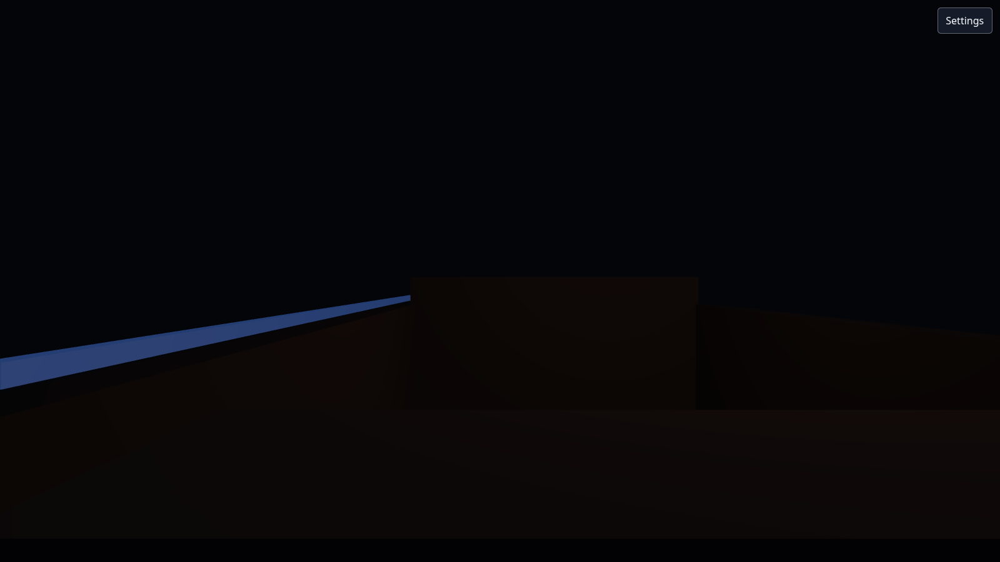
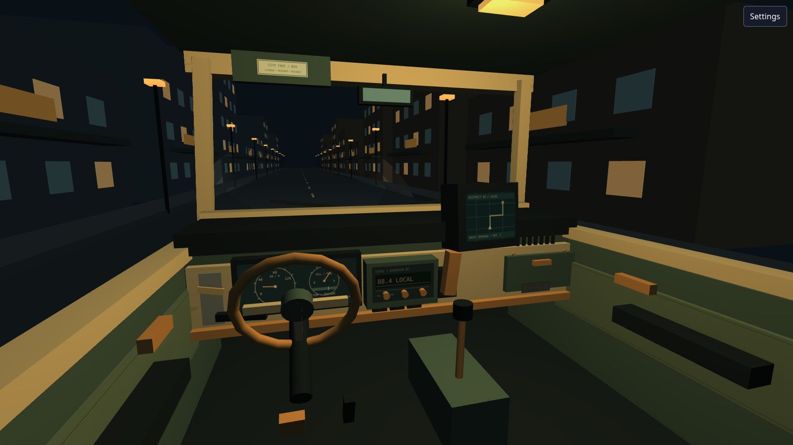
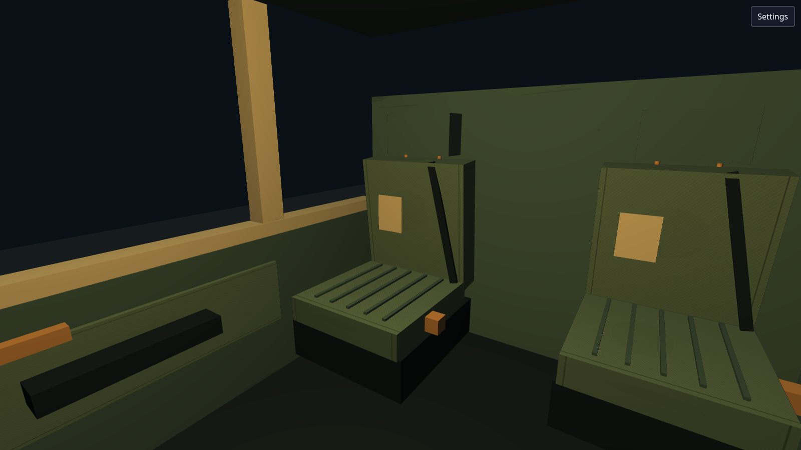
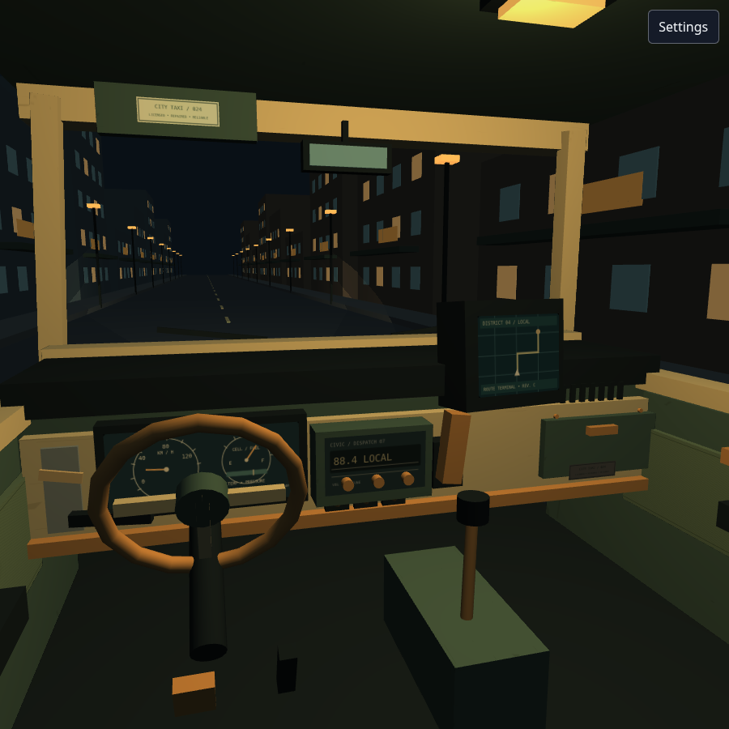

# Issue #66 cockpit visual review

Screenshots show the actual Babylon taxi scene reached through the normal `/` entry URL. The driver and square captures use the authored gameplay camera without query parameters or camera overrides. The passenger inspection capture changes only the browser camera pose after startup; it uses the same scene, geometry, and lighting.

## Fixed poses

Coordinates are taxi-local meters; rotations and FOV are radians, in Babylon X/Y/Z order.

| Capture | Viewport | Position | Rotation | Vertical FOV |
| --- | --- | --- | --- | --- |
| `before.png` | 1600 × 900 | −0.35, 0.78, −0.7 | 0, 0, 0 | 1.05 |
| `cockpit.png` | 1600 × 900 | −0.6, 1.2, −1.08 | 0.16, 0.26, 0 | 1.1 (63°) |
| `passenger.png` | 1600 × 900 | −0.5, 1.25, 0.65 | 0.25, 2.55, 0 | 1.1 |
| `compact.png` | 900 × 900 | −0.6, 1.2, −1.08 | 0.16, 0.26, 0 | 1.1 |

The baseline was captured before this branch's scene changes. All captures use device pixel ratio 1 and system Chromium 151 with software WebGL (SwiftShader). There is no time-dependent animation or random composition in this scene.

## Night lighting recipe

- Clear color: `(0.035, 0.063, 0.087)`.
- Hemisphere direction: `(0.2, 1, −0.25)`, cool color `(0.56, 0.65, 0.72)`, intensity `0.55`. Ground color is 35% of that color.
- Cabin point light at `(0.15, 1.72, 0.25)`: warm color `(1, 0.82, 0.57)`, intensity `1.1`, restricted to authored interior meshes. The dome diffuser marks its practical source.
- Two headlights at `(±0.75, 0.45, 3.2)`, direction `(0, −0.24, 1)`, color `(1, 0.86, 0.63)`, intensity `1.4`, range `32`, beam angle `0.7`, exponent `2`. Interior meshes are excluded.
- Instruments and route terminal are self-lit SVG faces. Street windows and lamps use restrained amber and cool emissive finishes.

## Reproduce

Start the usual Vite development server, then run:

```sh
npm run dev -- --host 127.0.0.1 --port 5173
node scripts/capture-taxi-scene.mjs
```

The capture script waits for application startup and scene readiness, collects browser exceptions, and prints geometry/material/startup metrics. It uses Playwright's installed Chromium by default. This cloud environment uses the installed system browser:

```sh
PLAYWRIGHT_CHROMIUM_EXECUTABLE=/usr/bin/chromium node scripts/capture-taxi-scene.mjs
```

`TAXI_CAPTURE_URL` can select another Vite server. The capture helper reads Vite's existing Engine module so it can inspect a fixed camera without adding production debug hooks.

## Review surfaces

### Original scene



### Normal driver view



### Passenger seating inspection



### Square viewport



## Remaining limitations

- Instrument needles, radio text and terminal map are authored presentation faces. Live gameplay bindings belong to the independent application work.
- The street establishes a visual composition; it is not a new moving route renderer. Route scenery can replace or overlap it until a later presentation integration defines that transition.
- The windshield and side openings have no glass/refraction simulation. The mirror is a readable opaque insert, not a reflection camera.
- Seats and repairs deliberately use low-poly geometry. Final stylized shading, outlines, stronger surface treatment and shadows remain for #70 and later art work.
- The square viewport retains the core controls and road; a dedicated portrait camera composition is not included.
- This proof covers the empty cockpit. Passenger rig sizing and conversational camera choreography require their own visual pass.

## Validation evidence

- Full local `npm run check`: lockfile contract, ESLint, 15 production-content checks, 34 save-compatibility checks, the full unit suite, strict TypeScript, production build and all configured size budgets.
- Existing production browser smoke on system Chromium 151, desktop and compact-touch projects, one worker: **10 passed / 4 intentional skips**. Includes the pinned Inochi/WASM rendering proof, personal spaces, settings persistence, touch layout and unsupported-WebGL fallback. Production startup-ready measured **1,158.4 ms / 5,000 ms**.
- Fixed screenshot tool: **465 authored meshes/instances, 24 scene materials, 10 texture objects, 7,032 triangles**. Repeated street and cabin shapes use instancing; these totals count all instances, including distant geometry outside the frustum.
- First concurrent software-WebGL smoke run hit a startup timing miss and the existing missing favicon. A repository-owned taxi SVG favicon resolves the resource error; the one-worker rerun passed. No timing budget or test assertion was relaxed.
- Firefox and WebKit were not run locally; their canonical CI projects remain unchanged. The local browser override was temporary and is not part of the branch.
